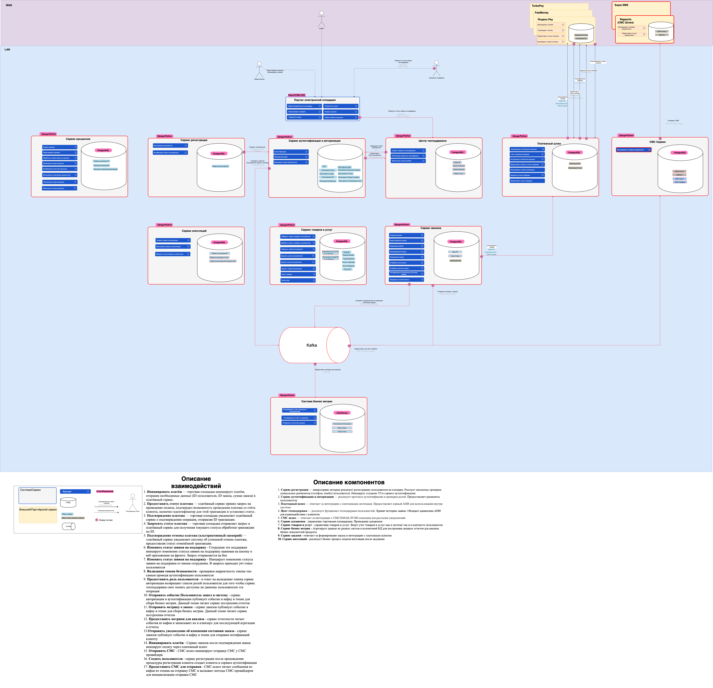

# Модуль 1. Микрофронтенты и микросервисы

## Задание 1. Микрофронтенты

### Текущая архитектура компонентов

**Основные компоненты системы**
- **PopupWithForm**. Базовое всплывающее окно
- **Header**. Отображение информации о текущем аутентифицрованном пользователе. Позволяет выйти из системы
- **Footer**. Информация о сервисе в футоре
- **ProtectedRoute**. Проверка аутентификации. Отображает компоненты только если пользователь аутентифицирован. Иначе редирек на вхож
- **Login**. Форма аутентификации по логину и паролю
- **Register**. Регистратор клиентов в системе
- **InfoTooltip**. Статус регистрации клиента
- **EditAvatarPopup**. Всплывающее окно для смена аватарки
- **EditProfilePopup**. Всплывающее окно для редактировании профиля
- **Card**. Отображение карточки в списке и управление состояием карточки
- **AddPlacePopup**. Добавление новой карточки
- **ImagePopup**. Окно просмотра изображения
- **App**. Корневой компонент для приложения

**Состояния**
- **InfoToolTipOpen:** Отображать окно c результатом последней операции
- **TooltipStatus:** Статус последней операции
- **email:** Email авторизованного пользователя
- **isLoggedIn:** Статус аутентификации
- **CurrentUserContext:** Информация о пользователе (Глобальный стейт)
- **EditAvatarPopupOpen:** Отображать окно замены аватарки
- **EditProfilePopupOpen:** Отображать окно редактирования профиля
- **AddPlacePopupOpen:** Отображать окно добавление карточки
- **Cards:** Список карточек
- **SelectedCard:** Текущая выбранная карточка

### Предлагаемое решение

#### **Модули микрофронтенда**. 

**Выбранная стратегия проектирования**: Вертикальная нарезка.

**Обосновнание**:
- Каждый из пользовательских сценариев которые мы выделаем ниже могут сильно усложниться так как затрагивают базовые бизнесс процессы нашего сервиса
- На текущем этапе развития приложения имеет не сложный бизнесс функционал который легко разделить.
- Код написал с использование единого стека и нет требований к его замене

##### Перечень модулей

###### **Сервис аутентификации и авторизации (auth).** 

В рамках данного сервиса предлагается вынести компоненты аутентификации и проверки доступа клиента
Данный функционал может быть достаточно общирен: могут добавляться новые способы входа, второй фактор входа черезе СМС или звонок и так далее 

Кроме этого данный модуль чувствителен с точки зрения безопасности и требует особых компетенций для разработки 

**Компоненты**: Login, ProtectedRoute

###### **Сервис регистрации (registrator).**

Сервис регистрации клиентов. Обладает потенциалом к расширению. Могут добавляться новые требования к учетным записям (обновлятся обязательность полей) для чего потребуется реализовывать нвоые сценарии - деригистрации и так далее

В случае если мы разреши клиентам регистрироваться и номеру телефона и по емейлу у нас могут возникать конфликты в случае если пользователь захочет добавить к себе в профиль уже существующий телефон. Для решения таких проблем нужны будут доработки этого модуля

**Компоненты**: Register

###### Кабинет клиента (cabinet).

Сервис управления пользовательскими данными. Позволяет изменить аватарку или описание профиля

В будущем может вырости в полноценный личный кабинет пользователя, со статистикой и детальной настройкой своего аккаунта

**Компоненты**: EditAvatarPopup, EditProfilePopup

###### Сервис карточек (cards)

Отвечает за управление списоком карточкек. Отображением фотографий. Основной функционал ленты сервиса

**Компоненты**: Card, AddPlacePopup, ImagePopup

###### Базовые компоненты (core)

Базовые библиотеки и компоненты системы. Выносим общие компоненты для унификации (например InfoTooltip или PopupWithForm)

**Компоненты**: PopupWithForm, InfoTooltip

###### Основное приложение (host)

Основное приложение. Содержит компоненты Header, Footer и App

**Компоненты**: App, Header, Footer

#### **Слой композиции**. 

**Тип**: Run time

**Обосновнание**:
- Разделяемые модули могут разрабатываться отдельными командами со своими графиками развертывания
- В сервисе пока мало функционала. Планиурется активное развитие. Требуется часто обновлять разные компоненты

**Инструмент**: Webpack Module Federation

#### Как запускать
- Выполнены только 1-2 части задания. 

## Задание 2. Микросервисы

### Схема

[Ссылка на схему](https://drive.google.com/file/d/1Nn7h5kInAK3KwUb0Ugu2-zPspI8JvSk3/view?usp=sharing)

[Ссылка на файл](assets/arch_task2_solution.drawio)

### Описание компонентов
1. Сервис регистрации — микросервис которые реализует регистрацию пользователя на площаке. Реалзует махнизмы проверки уникальных реквизитов (телефон, емейл) пользователя. Иницирует создание УЗ в сервисе аутентификации

2. Сервис аутентификации и авторизации — реализует протокол аутентификаии и проверки ролей. Предоставляет реквизиты пользователя

3. Платежный шлюз — отвечает за интеграцию с платежными системами. Предоставляет единый АПИ для использования внутри системы

4. Цент техподдержки — реализует фунционал техподдержки пользоватлей. Хранит историю заявок. Обладает админским АПИ для взаимодействия с клиентом

5. СМС шлюз — отвечает за интеграцию с СМС/EMAIL/PUSH шлюзами для рассылки уведомлений.

6. Сервис аукционов - управление торговыми площадками. Проведение аукционов

7. Сервис товаров и услуг - справочник товаров и услуг. Ведет учет товаров и услуг как в системе так и в контексте пользователя

8. Сервис бизнес метрик - Агрегирует данные их разных систем в колоночной БД для построения сводных отчетов для анализа бизнес показателей продукта

9. Сервис заказов - отвечает за формирование заказа и интеграцию с платежным шлюзом

10. Сервис апелляций - реализует бизнес процесс подачи апелляции после акуциона

### Описание взаимодействия

1. Инициировать платёж — торговая площадка инициирует платёж, отправив необходимые данные (ID пользователя, ID заказа, сумма заказа) в платёжный сервис.

2. Предоставить статус платежа — платёжный сервис принял запрос на проведение оплаты, подтвердил возможность проведения платежа со счёта клиента, назначил идентификатор для этой транзакции и установил статус.

3. Подтверждение платежа — торговая площадка уведомляет платёжный сервис о подтверждении операции, отправляя ID транзакции.

4. Запросить статус платежа — торговая площадка отправляет запрос в платёжный сервис для получения текущего статуса обработки транзакции по ID.

5. Подтверждение отмены платежа (альтернативный сценарий) — платёжный сервис уведомляет систему об успешной отмене платежа, предоставляя статус отменённой транзакции.

6. Изменить статус заявки на поддержку - Сотрудник тех поддержки иницирует изменение статуса заявки на поддержку нажимая на кнопку в веб приложении на фронте. Запрос отправляется на бек

7. Изменить статус заявки на поддержку - Иницирует изменение статуса заявки на поддержки от имени сотрудника. В запросе приходит jwt токен пользователя

8. Валидация токена безопасности - проверяем корректность токена тем самым проводя аутентификацию пользователя

9. Предоставить роль пользователя - в ответ на валидацию токена сервис авторизации возвращяет список ролей пользователя для того чтобы сервис техподдержки смог понять доступна ли данному пользователю эта операция

10. Отправить событие Пользователь зашел в систему - сервис авторизации и аутентификации публикует событие в кафку в топик для сбора бизнес метрик. Данный топик читает сервис построения отчетов

11. Отправить метрику о заказе - сервис заказов публикует событие в кафку в топик для сбора бизнес метрик. Данный топик читает сервис построения отчетов

12. Предоставить метрики для анализа - сервис отчетности читает события из кафки и записывает их в кликхаус для последующей агрегации в отчеты

13.Отправить уведомление об изменении состояния заказа - сервис заказов публикует событие в кафку в топик для отправки нотификаций клиенту

14. Инициировать платёж - Сервис заказов после подтверждения заказа иницирует оплату через платежный шлюз

15. Отправить СМС - СМС шлюз инициирует отправку СМС у СМС провайдера

16. Создать пользователя - сервис регистрации после прохождения процедуры регистрации клиента создает клиента в сервисе аутентификации

17. Предоставить СМС для отправки - СМС шлюз читает сообщения из кафки из топика на отправку СМС и вызывает методы СМС-провайдеров для инициализации отправки СМС

