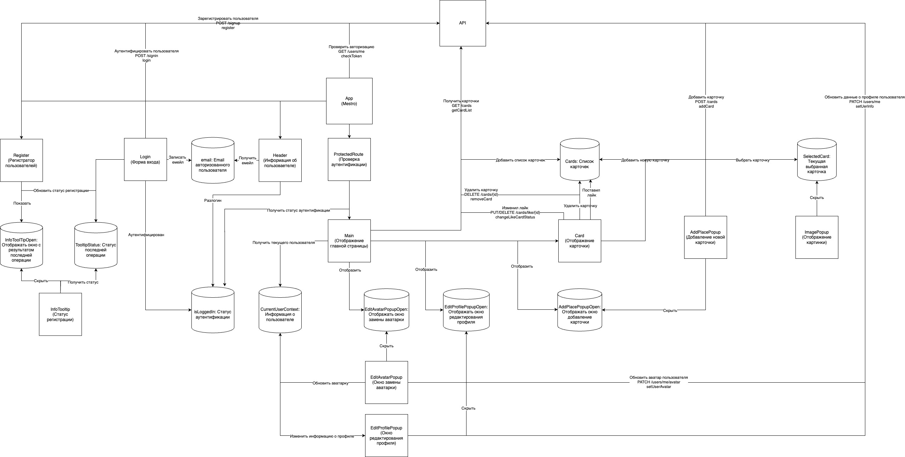
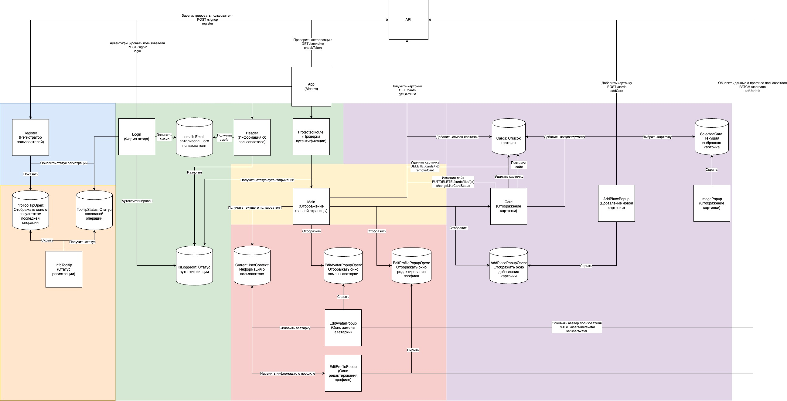

# Модуль 1. Микрофронтенты и микросервисы

## Задание 1. Микрофронтенты

### Текущая архитектура компонентов

**Основные компоненты системы**
- **PopupWithForm**. Базовое всплывающее окно
- **Header**. Отображение информации о текущем аутентифицрованном пользователе. Позволяет выйти из системы
- **Footer**. Информация о сервисе в футоре
- **ProtectedRoute**. Проверка аутентификации. Отображает компоненты только если пользователь аутентифицирован. Иначе редирек на вхож
- **Login**. Форма аутентификации по логину и паролю
- **Register**. Регистратор клиентов в системе
- **InfoTooltip**. Статус регистрации клиента
- **EditAvatarPopup**. Всплывающее окно для смена аватарки
- **EditProfilePopup**. Всплывающее окно для редактировании профиля
- **Card**. Отображение карточки в списке и управление состояием карточки
- **AddPlacePopup**. Добавление новой карточки
- **ImagePopup**. Окно просмотра изображения
- **App**. Корневой компонент для приложения

**Состояния**
- **InfoToolTipOpen:** Отображать окно c результатом последней операции
- **TooltipStatus:** Статус последней операции
- **email:** Email авторизованного пользователя
- **isLoggedIn:** Статус аутентификации
- **CurrentUserContext:** Информация о пользователе (Глобальный стейт)
- **EditAvatarPopupOpen:** Отображать окно замены аватарки
- **EditProfilePopupOpen:** Отображать окно редактирования профиля
- **AddPlacePopupOpen:** Отображать окно добавление карточки
- **Cards:** Список карточек
- **SelectedCard:** Текущая выбранная карточка

### Предлагаемое решение

#### **Модули микрофронтенда**. 

**Выбранная стратегия проектирования**: Вертикальная нарезка.

**Обосновнание**:
- Каждый из пользовательских сценариев которые мы выделаем ниже могут сильно усложниться так как затрагивают базовые бизнесс процессы нашего сервиса
- На текущем этапе развития приложения имеет не сложный бизнесс функционал который легко разделить.
- Код написал с использование единого стека и нет требований к его замене

##### Перечень модулей

###### **Сервис аутентификации и авторизации (auth).** 

В рамках данного сервиса предлагается вынести компоненты аутентификации и проверки доступа клиента
Данный функционал может быть достаточно общирен: могут добавляться новые способы входа, второй фактор входа черезе СМС или звонок и так далее 

Кроме этого данный модуль чувствителен с точки зрения безопасности и требует особых компетенций для разработки 

**Компоненты**: Login, ProtectedRoute

###### **Сервис регистрации (registrator).**

Сервис регистрации клиентов. Обладает потенциалом к расширению. Могут добавляться новые требования к учетным записям (обновлятся обязательность полей) для чего потребуется реализовывать нвоые сценарии - деригистрации и так далее

В случае если мы разреши клиентам регистрироваться и номеру телефона и по емейлу у нас могут возникать конфликты в случае если пользователь захочет добавить к себе в профиль уже существующий телефон. Для решения таких проблем нужны будут доработки этого модуля

**Компоненты**: Register

###### Кабинет клиента (cabinet).

Сервис управления пользовательскими данными. Позволяет изменить аватарку или описание профиля

В будущем может вырости в полноценный личный кабинет пользователя, со статистикой и детальной настройкой своего аккаунта

**Компоненты**: EditAvatarPopup, EditProfilePopup

###### Сервис карточек (cards)

Отвечает за управление списоком карточкек. Отображением фотографий. Основной функционал ленты сервиса

**Компоненты**: Card, AddPlacePopup, ImagePopup

###### Базовые компоненты (core)

Базовые библиотеки и компоненты системы. Выносим общие компоненты для унификации (например InfoTooltip или PopupWithForm)

**Компоненты**: PopupWithForm, InfoTooltip

###### Основное приложение (host)

Основное приложение. Содержит компоненты Header, Footer и App

**Компоненты**: App, Header, Footer

#### **Слой композиции**. 

**Тип**: Run time

**Обосновнание**:
- Разделяемые модули могут разрабатываться отдельными командами со своими графиками развертывания
- В сервисе пока мало функционала. Планиурется активное развитие. Требуется часто обновлять разные компоненты

**Инструмент**: Webpack Module Federation

#### Как запускать
- Выполнены только 1-2 части задания. 

## Задание 2. Микросервисы